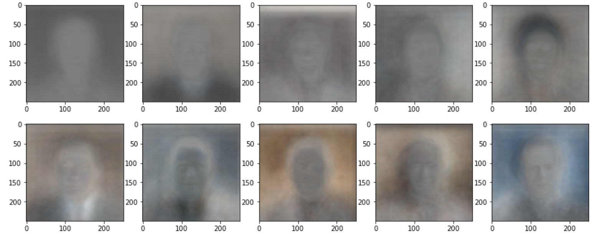
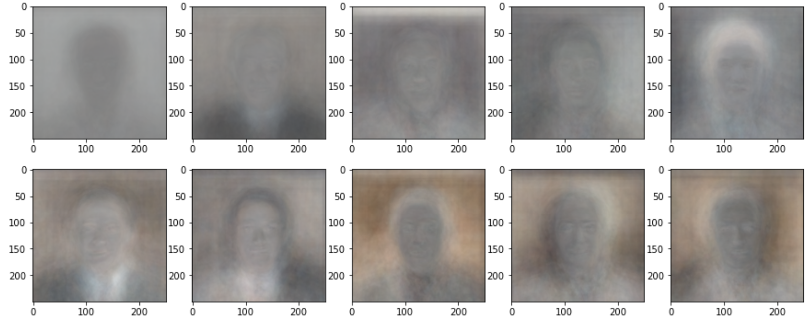
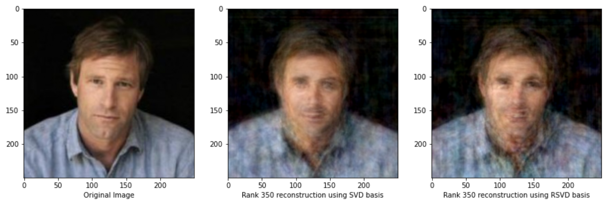
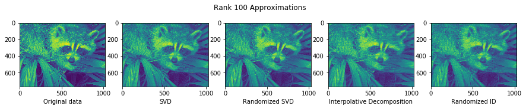

# Random Projections
This repository is a collection of our group's work during the Summer@ICERM 2020 REU program.

A link to an Overleaf document with a thorough explanation of the mathematical background and results can be found [here](./docs/final_report.pdf).

## Experiments (non-exhaustive)
The `notebooks` folder contains all of our coding experiments.

### Eigenfaces
We use a database of real pictures of faces to extract the components of an average face, which can be added up to reconstruct approximations to any specific face.

##### Eigenfaces calculated deterministically

##### Randomized approximation of the eigenfaces

##### Reconstruction of a face using eigenfaces

### Image Compression
We use randomization to find low-rank approximations to image, making it easier to use these images for data analysis and computation.

##### Example of image compression

The left-most image is the original image, and the rest are various forms of approximations.

### JL Lemma
We numerically verify some of the claims made in the [Johnson-Lindenstrauss Lemma](https://en.wikipedia.org/wiki/Johnson%E2%80%93Lindenstrauss_lemma).

### Least Squares
We compute approximate 'least-square' solutions to linear systems that do not have an exact solution, and then compare the accuracy to that of the best of a randomly sampled set of vectors.

### Kernel PCA
Certain datasets are not always linearally seperable. To solve this problem we use randomized kernel methods to map data into a higher-dimensional space where PCA is then performed. 

### Kernel SVM
If we want to train a model on a set of labeled data, one option is to use a Support Vector Machine (SVM). Using a randomized kernel function, we experiment with SVM on the MNIST dataset.

## Presentations
The `presentations` folder contains all our files for the biweekly group presentations at ICERM. These mostly consist of Jupyter notebooks with extensive descriptions and explanations of the code / phenomena.

## Installation
To reproduce our results by running the experiments provided in this repository, you will need to have access to all the Python packages imported in the various files. We recommend using Anaconda/conda to set up a virtual environoment and install all packages so as to not interfere with any other projects in your file system.

You will also need to download the datasets used for our experiments (LFW, MNIST). A full list can be found in the linked Overleaf document. A dataset named `dataset1` should be stored in the following directory:

    random-projections/datasets/dataset1

## Authors
- Rishi Advani
- Madison Crim
- Sean O'Hagan

## References
A full list of references will be provided in the Overleaf document.

## Acknowledgements
Thank you to our organizers, Akil Narayan and Yanlai Chen, along with our TAs, Justin Baker and Liu Yang, for supporting us throughout this program.
