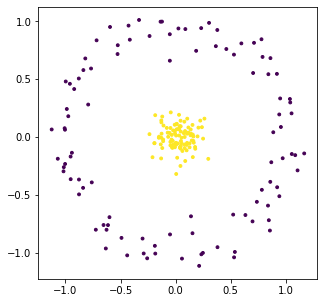
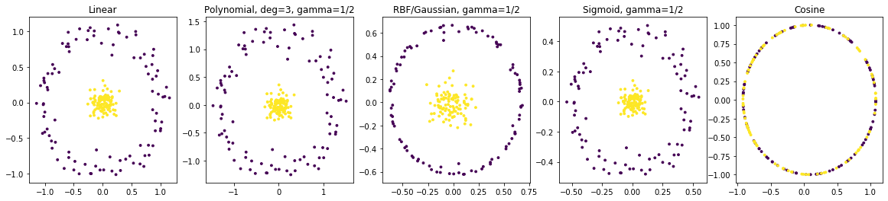
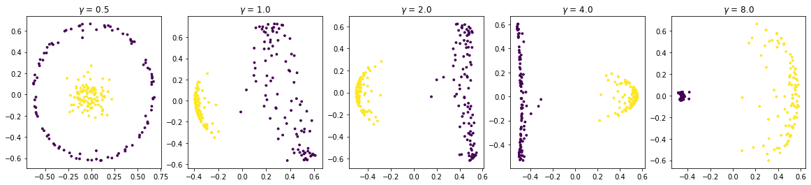
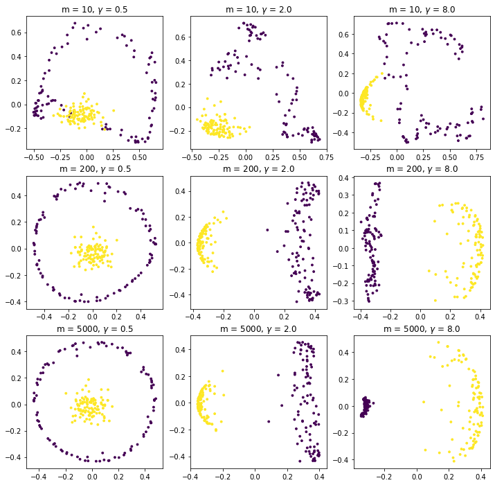
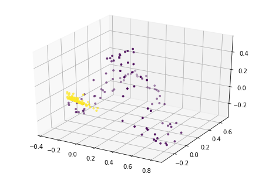
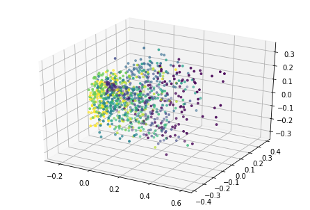
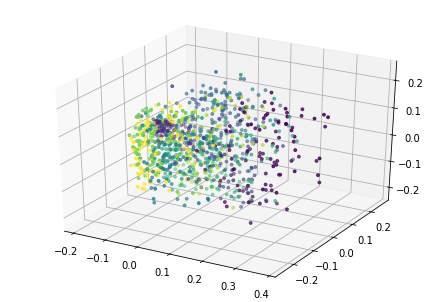
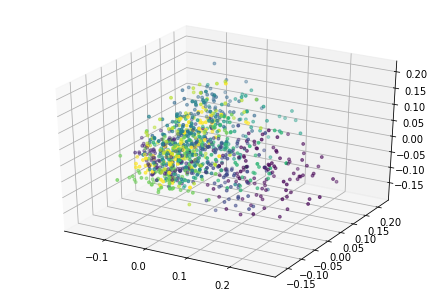

```python
import numpy as np
from sklearn.decomposition import KernelPCA
import matplotlib.pyplot as plt
from time import perf_counter
import pandas as pd
from mpl_toolkits.mplot3d import Axes3D
from tqdm import tqdm

%matplotlib inline
```

## Principle Component Analysis

Principle component analysis (PCA) is a technique for _linear dimension reduction_. Since some measurements/features of data may tell us a lot about it, and other may not tell us as much, our goal is to find a smaller set of measurements that still capture most of the interesting information.

In PCA, our goal specifically is to calculate an orthogonal set of linear combinations of features that captures the most variance of the data.

Let's say we have $n$ points in $\mathbb{R}^d$, and we want to represent them as points in $\mathbb{R}^k$, with $k<d$. Write this dataset as a matrix $X\in\mathbb{R}^{n\times d}$, and then let $X_0$ represented the _centered_ version, obtained by subtracting the mean of each column from all the entries in that column. Then
$$D = \frac{1}{n}X_0^T X_0$$
is the covariance matrix of the data $X$. Note $D$ is a symmetric, $n\times n$, positive semi-definite matrix.

Saving the details, it turns out that the eigendecomposition $D = Q\Lambda Q^T$ solves our problem: the columns of $Q$ form an orthonormal basis for the span of the data, and they are ordered in terms of how much variability of the data they capture, with the order determined by the corresponding eigenvalues in $\Lambda$ (the spectral theorem guarantees that the eigenvalues will be real and nonnegative).

Here's an example illustrating what the principle components will be for a 2 dimensional set of data points:


The red and green arrows represent the principle components, or eigenvectors found in $Q$. Note that they are orthogonal. While this two dimensional example is simplistic, it provides intuition for the case of higher dimensional data. 

## Kernel PCA

Not every dataset is linearly separable. For this reason, we introduce kernel methods. Kernel methods are class of methods used not only in PCA, but in other algorithms as well (SVM, coming later).

In order to solve the problem of lack of linear separability, we map the data into a higher dimensional space using a _kernel_, which is a type of function that satisfies certain properties. Examples of kernel functions include:

$$\text{Linear kernel: }\quad k(x,y) = x^Ty$$

$$\text{Gaussian (rbf) kernel: }\quad k(x,y) = \exp(-\gamma \|x-y\|_2^2)$$

## Creating Data

Let's look at a cloud of data points surrounded by a circle. For this example, for each entry in the inner cloud is drawn from a $N(0,0.01)$, and each entry of the outer circle is sampled from a unit circle, with $N(0,0.01)$ noise added to each coordinate. 

We use this as an example that is not linearly separable, so kernel methods will work to our advantage.


```python
sampling_size = 100

sample = np.arange(sampling_size) * (np.pi/50)
outer_cloud = np.concatenate((np.expand_dims(np.cos(sample),1), 
                              np.expand_dims(np.sin(sample),1)), axis=1) + 0.1 * np.random.randn(sampling_size, 2)

inner_cloud = 0.1 * np.random.randn(sampling_size,2)

data = np.concatenate((outer_cloud, inner_cloud), axis=0)
colormap = np.concatenate((np.zeros(sampling_size),np.ones(sampling_size)))
```


```python
plt.figure(figsize=(5,5))
plt.scatter(data[:,0], data[:,1], s=8, c=colormap);
```





### Some embeddings of the data

Here we view some embeddings of the data with various kernels as part of `sklearn` with their default hyperparameters. By embeddings, we are referring to the projection of the data onto the two principle components corresponding to the greatest eigenvalues.


```python
emb = np.empty((5, 2*sampling_size, 2))
```


```python
emb[0] = KernelPCA(n_components=2, kernel='linear').fit_transform(data)
emb[1] = KernelPCA(n_components=2, kernel='poly').fit_transform(data)
emb[2] = KernelPCA(n_components=2, kernel='rbf').fit_transform(data)
emb[3] = KernelPCA(n_components=2, kernel='sigmoid').fit_transform(data)
emb[4] = KernelPCA(n_components=2, kernel='cosine').fit_transform(data)
```


```python
desc = ['Linear','Polynomial, deg=3, gamma=1/2', 'RBF/Gaussian, gamma=1/2', 'Sigmoid, gamma=1/2', 'Cosine']

fig,axes = plt.subplots(1,5, figsize=(20,4))
for i,ax in enumerate(axes.flat):
    ax.scatter(emb[i,:,0], emb[i,:,1], s=8, c=colormap)
    ax.set_title(desc[i])
```





### Varying Gamma for RBF (Gaussian) Kernel

Now, we may vary the $\gamma$ parameter of the radial basis function kernel in order to find embeddings in which the data becomes linearly separable.


```python
gamma_vals = np.asarray([0.5, 1, 2, 4, 8])

emb = np.empty((gamma_vals.shape[0], 2*sampling_size, 2))

for i in range(gamma_vals.shape[0]):
    emb[i] = KernelPCA(n_components=2, kernel='rbf', gamma=gamma_vals[i]).fit_transform(data)

fig,axes = plt.subplots(1,gamma_vals.shape[0], figsize=(4*gamma_vals.shape[0],4))
for i,ax in enumerate(axes.flat):
    ax.scatter(emb[i,:,0], emb[i,:,1], s=8, c=colormap)
    ax.set_title(f"$\gamma$ = {gamma_vals[i]}")
```





## Approximating the Kernel with Random Fourier Features

Calculating the kernel may be computationally expensive. There exist multiple ways to approximate it, but we talk about the method of random Fourier features (Rahimi & Recht, 2008). If our data points are in $\mathbb{R}^d$, assuming the kernel function has an inverse Fourier transform $p(w)$, we may express the kernel as 

$$k(x,y) = \int_{\mathbb{R}^d} p(w) e^{iw^T(x-y)}dw$$

and we may approximate this integral by a form of Monte Carlo:

$$\sum_{j=1}^m \frac{1}{m} \cos(w_i^Tx + b_i)\cos(w_i^Ty + b_i)$$

where $w_i\sim p(w)$, $b_i\sim \text{Uniform }(0,2\pi)$. $m$ is the amount of random Fourier features sampled to approximate the integral.


```python
def RKPCA(data, n_components, m, s=1):
    X = np.copy(data) # n x d
    n, d = X.shape
    b = np.random.uniform(low=0, high = 2*np.pi, size=(1,m))
    W = np.random.multivariate_normal(mean=np.zeros(d), cov=2*s*np.eye(d), size=m) # m x d
    Z = np.empty((n,m))
    Z = np.cos(X @ W.T + b) # n x m
    K = 1/m * Z @ Z.T
    return KernelPCA(n_components=n_components, kernel='precomputed').fit_transform(K)
```


```python
def plot(embedding, color_labels):
    if(embedding.shape[1] == 2):
        plt.scatter(embedding[:,0],embedding[:,1],s=8,c=color_labels)
    elif(embedding.shape[1] == 3):
        ax = Axes3D(plt.figure())
        ax.scatter(embedding[:,0],embedding[:,1],embedding[:,2], s=8, c=color_labels)
    else:
        raise ValueError
    plt.show()
```

Here, we create a grid of plots with $m$ values (the number of random Fourier features sample) changing on one axis, and $\gamma$ changing on the other axis. Note that as $m$ increases, the embeddings more closely resemble their deterministic counterparts with the same $\gamma$ values.


```python
gamma_vals = np.asarray([0.5, 2, 8])
m_vals = np.asarray([10, 200, 5000])

emb = np.empty((gamma_vals.shape[0], m_vals.shape[0], 2*sampling_size, 2))

for i in range(gamma_vals.shape[0]):
    for j in range(m_vals.shape[0]):
        emb[i,j] = RKPCA(data, 2, m_vals[j], s=gamma_vals[i])

fig,axes = plt.subplots(m_vals.shape[0],gamma_vals.shape[0], figsize=(4*gamma_vals.shape[0],4*m_vals.shape[0]))
for i in range(gamma_vals.shape[0]):
    for j in range(m_vals.shape[0]):
        axes[j,i].scatter(emb[i,j,:,0], emb[i,j,:,1], s=8, c=colormap)
        axes[j,i].set_title(f"m = {m_vals[j]}, $\gamma$ = {gamma_vals[i]}")
```





```python
n, d = data.shape
```

We may also plot against the three largest principle components


```python
plot(RKPCA(data, 3, 10), colormap)
```





## Experiments on MNIST 

We also examine the classic MNIST dataset, as it is a larger dataset, with $60,000$ samples of $784$ features instead of only the $2$ in our previous example.


```python
mnist = pd.read_csv('../datasets/mnist/train.csv')

full_X = mnist[mnist.columns[1:]].values / 255
full_y = mnist.label.values

X = full_X[:1000]
y = full_y[:1000]
```


```python
n,d = X.shape
```

### KPCA with polynomial kernel


```python
emb = KernelPCA(n_components=3, kernel='poly').fit_transform(X)
plot(emb, y)
```





### KPCA with gaussian kernel


```python
emb = KernelPCA(n_components=3, kernel='rbf').fit_transform(X)
plot(emb, y)
```





### RKPCA emulating gaussian kernel


```python
plot(RKPCA(X, 3, 100, s=1/X.shape[1]), y)
```




